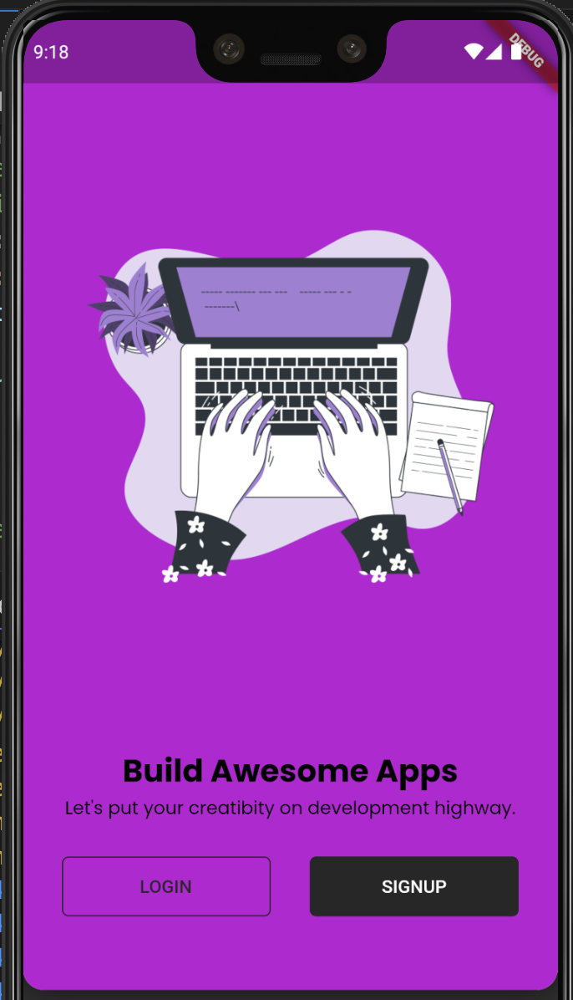
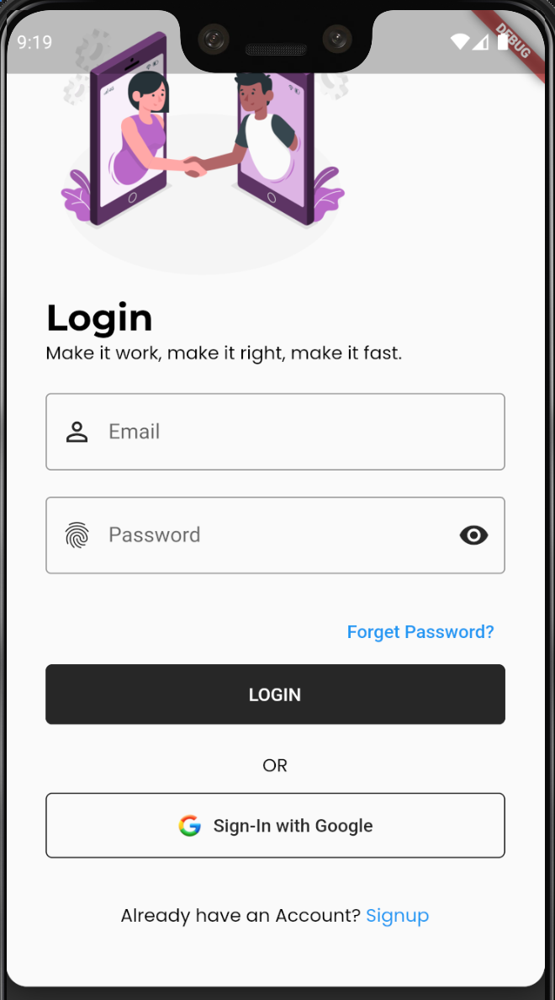
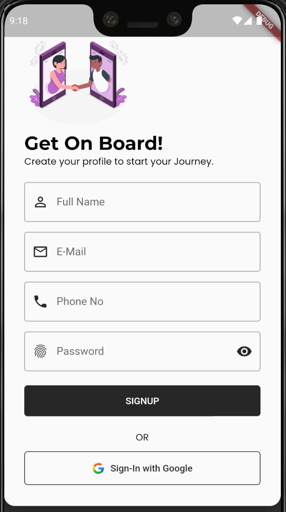
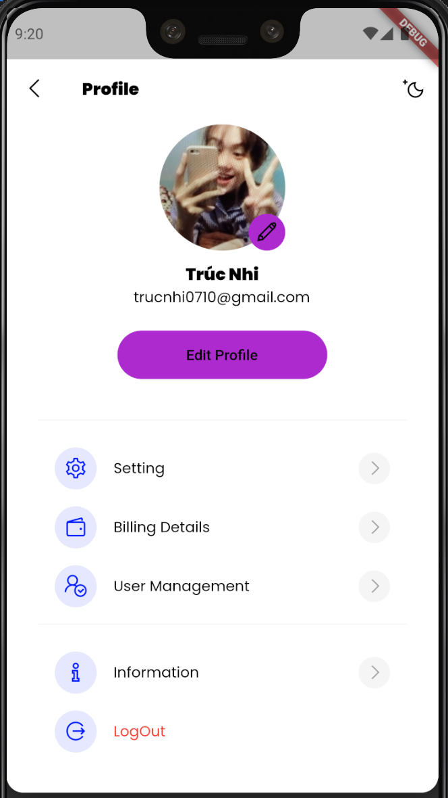

# STUDY APP
## Team  Members:
```bash
Saigon University ,Faculty of Information Technology ,Major in Software Engineering
ID          | Full Name
3120410316    Quan Văn Mạnh
```
## Project Description:
Build a teaching app with basic functions
## Tech Stack Used:
```bash
    * Dart
    * Firebase
```
## App Functions:
```bash
   * Login(google) / Register / Logout
   * EditProfile
   * See lesson
```
## [Project Demo Link](hi?)
## Some features of the site:
Home Page                   |                   Introduce Page
:---------------------------------:        |      :------------------------------:
  | 

Login Page                   |                   SignUp Page
:---------------------------------:        |      :------------------------------:
  | 

EditProfile Page                   |             
:---------------------------------:        


### Make sure to star the repository if you find it helpful!
<a href="https://github.com/Manh-IT-K2/StudyApp/stargazers"></a>
